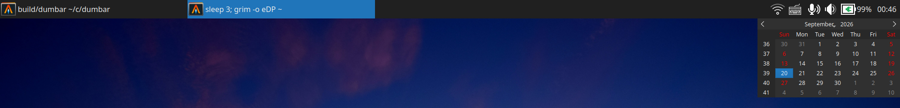

# dumbar

A simple wayland panel and taskbar built with Qt 6.

## Supported widgets

- Taskbar with live windows, application icons, focus, minimize, close, and drag-and-drop reordering
- System tray with StatusNotifier items and context menus
- Speaker and microphone volume controls with mute and mouse-wheel adjustment
- Battery percentage, charging state, and remaining-time display
- Clock with hover tooltip and calendar popup

## Dependencies

- Qt 6: Core, Gui, Widgets, DBus, and WaylandClient
- LayerShellQt
- Wayland client libraries and `wayland-scanner`
- PulseAudio

This was written by GPT 5.6 Luna in a single day. Currently, all configuration is hardcoded.
